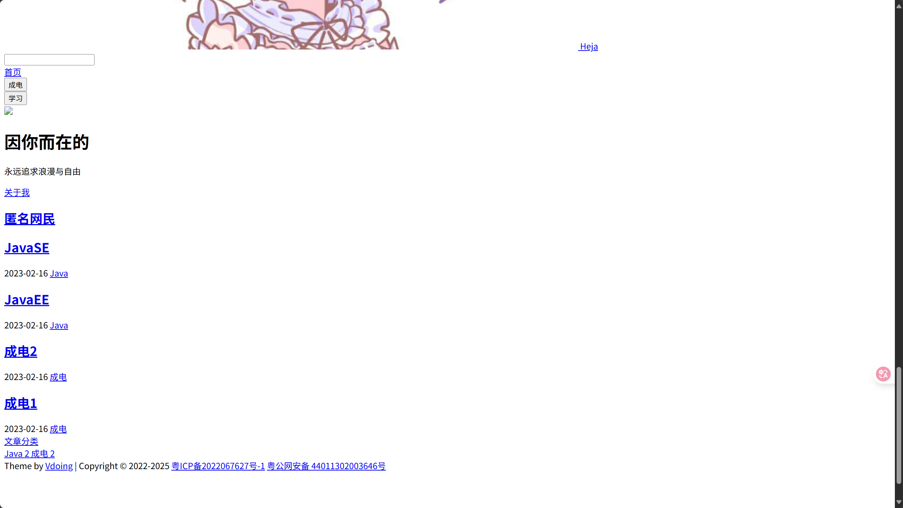

### 本地搭建
参考 https://www.peterjxl.com/Blog/

### GitHub page部署教程
参考 https://xie.infoq.cn/article/4d2f62c87d188331342e62563

### 好，问题来了
期待中，打开https://wcacciatori.github.io/Blog/ 应该是这个样子

然而……

这什么玩意？？？好好好，想必是GitHubpage和vuepress不兼容，让我找找解决办法
